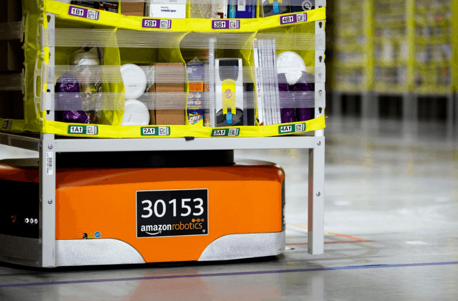
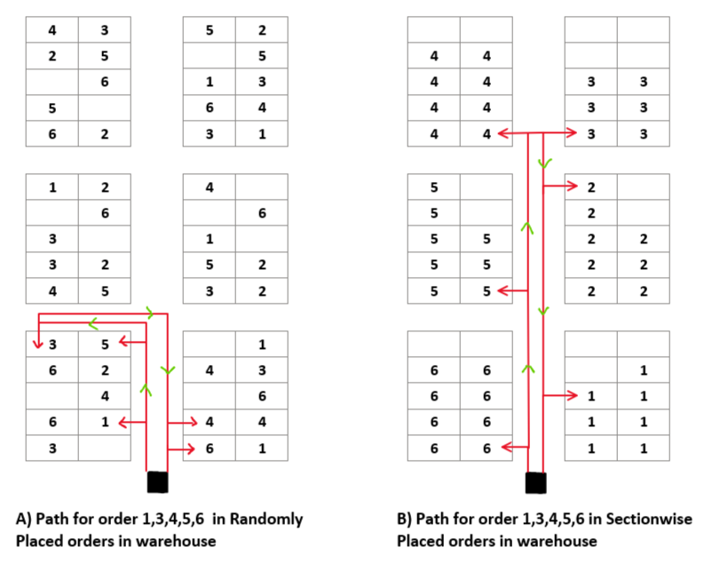
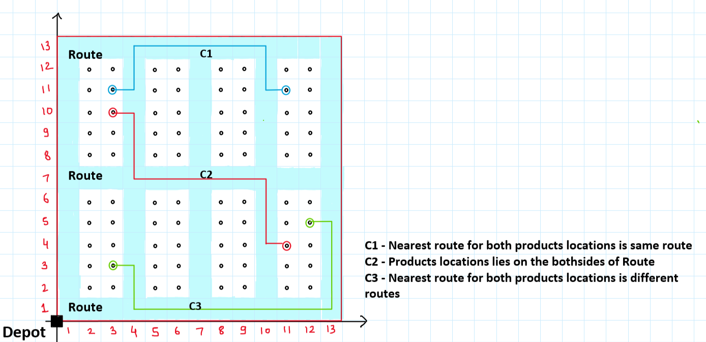
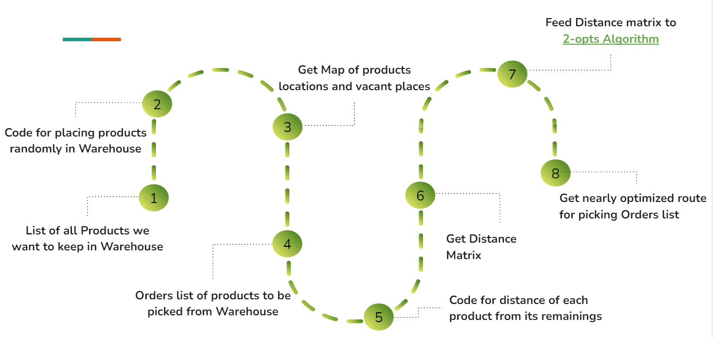
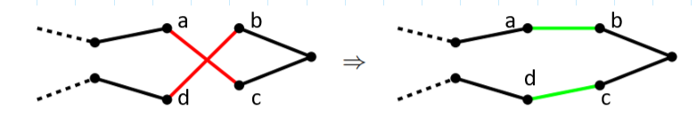
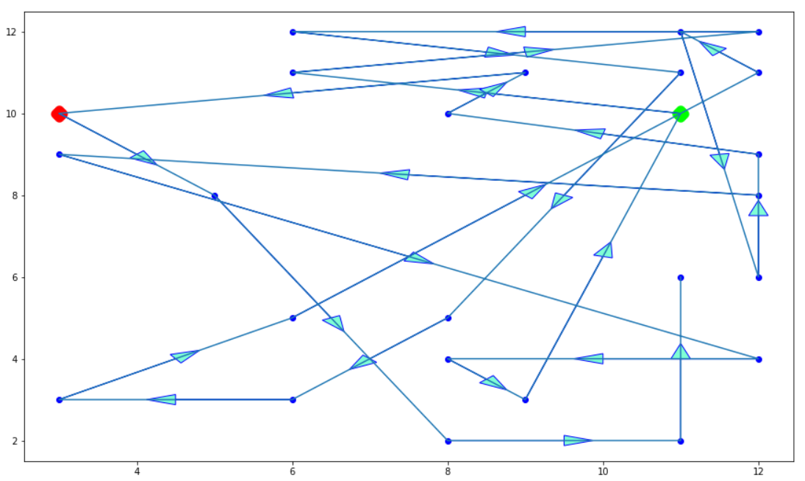
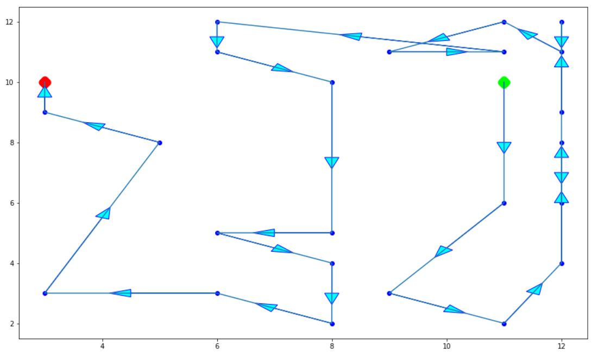
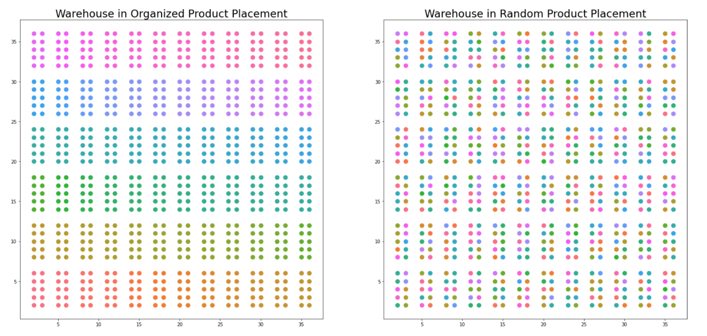
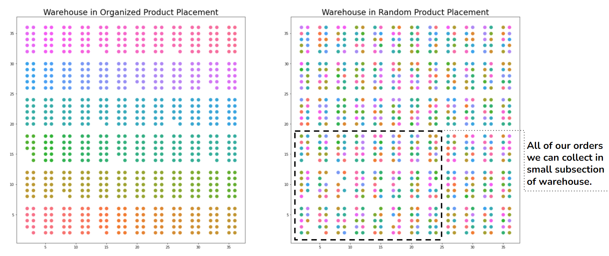

# Route Optimization Software for Inventory Management in  Warehouses

## Inspiration 
1) Studies on warehouses revealed that 55-60% time of employees who picks the order from warehouse spent travelling. [[Article](https://6river.com/what-is-picking-in-a-warehouse/)]
2) Developing an efficient system which will convert this randomness into meaningful time saving and space optimizing decisions is the need of warehouse management.
3) Tye Brady, Chief Technologist at Amazon Robotics said , “We want our large objects to be mixed with our small objects to be mixed with our medium objects because it optimises volume.”.[[Article](https://consumerreturns.wbresearch.com/blog/amazon-reverse-logistics-warehouses-strategy)]

  

  

## Randomness approach to problem 
1) We found that we can collect most of or all of the order in small subsection of warehouse rather than reaching other end of warehouse for small numbers of products.
When many customers order their set of products that they want we can combine them and derive one path where workers from the warehouse could collect all required items with significantly less amount of time.

  

  

## Defined Warehouse Unit
1) Repeating Unit of Warehouse structure

  

  

## Software Flowchart

  

  

## 2-OPT Algorithm Used for Shortest Path Finding 
1) It take 2 segments from the route, reconnect these segments with each other and calculate new travel distance. If this modification has led to a shorter total travel distance the current route is updated. The algorithm continues to build on the improved route and repeats the steps.

  

  
2. Example of path finding in warehouse for given orders
  

  
  

  

## Warehouses Before We Pick Our First Order
1) There are 72 different products (10 each) denoted by 72 different colours. 

  

  

## Warehouses After We Pick Our First Order
1) We found that we can collect most of or all of the order in small subsection of warehouse as a result we get distance of 93 units (≈35% less) in randomly placed products and 140 units in organized products. 

  

  

